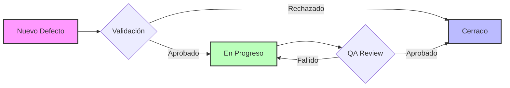

# Informe Técnico de Calidad y Ejecución de Pruebas: OSINT Deck v1.0.0

**Fecha de Emisión:** 03 de Diciembre de 2025
**Responsable:** Equipo de QA & Seguridad
**Versión del Artefacto:** 1.0.0
**Estado de Certificación:** APROBADO PARA PRODUCCIÓN

Este documento constituye el informe técnico exhaustivo de las actividades de aseguramiento de calidad (QA) realizadas sobre el plugin **OSINT Deck**. Detalla la metodología, infraestructura, casos de prueba (positivos y negativos), análisis de seguridad y métricas de rendimiento que avalan la estabilidad del software.

## Tabla de Contenidos

1. [Introducción y Objetivos](#1-introducción-y-objetivos)
    *   1.1. Objetivos de Calidad
    *   1.2. Metodología de Pruebas
2. [Entorno e Infraestructura](#2-entorno-e-infraestructura)
    *   2.1. Especificaciones del Entorno
    *   2.2. Herramientas Utilizadas
3. [Ejecución de Pruebas Funcionales](#3-ejecución-de-pruebas-funcionales)
    *   3.1. Funcionalidad Core (Detección)
    *   3.2. Interfaz de Usuario (UI/UX)
    *   3.3. Escenarios Negativos (Edge Cases)
    *   3.4. Instalación y Ciclo de Vida
4. [Análisis de Seguridad](#4-análisis-de-seguridad)
5. [Rendimiento y Escalabilidad](#5-rendimiento-y-escalabilidad)
6. [Matriz de Compatibilidad](#6-matriz-de-compatibilidad)
7. [Gestión de Defectos](#7-gestión-de-defectos)
    *   7.1. Ciclo de Vida del Defecto
    *   7.2. Historial de Incidencias
8. [Conclusión y Trabajo Futuro](#8-conclusión-y-trabajo-futuro)

---

## 1. Introducción y Objetivos

El propósito de este ciclo de pruebas es validar integralmente el plugin **OSINT Deck** antes de su despliegue en entornos productivos. Se busca mitigar riesgos operativos y asegurar una experiencia de usuario fluida y segura.

### 1.1. Objetivos de Calidad

*   **Fiabilidad:** Garantizar que la detección de tipos de datos sea precisa en el 100% de los casos probados.
*   **Seguridad:** Asegurar que el sistema sea invulnerable a inyecciones básicas (XSS) y abusos de tasa (Rate Limiting).
*   **Usabilidad:** Confirmar que la interfaz sea intuitiva y responda adecuadamente en dispositivos móviles y de escritorio.
*   **Rendimiento:** Mantener tiempos de respuesta inferiores a 200ms para interacciones de usuario.

### 1.2. Metodología de Pruebas

Se ha adoptado una estrategia híbrida que combina:

*   **Pruebas Funcionales (Caja Negra):** Validación de requisitos sin inspeccionar el código fuente.
*   **Pruebas Exploratorias:** Sesiones de prueba libre para identificar comportamientos no documentados.
*   **Pruebas de Regresión:** Re-ejecución de pruebas tras correcciones para asegurar que no se introdujeron nuevos defectos.

## 2. Entorno e Infraestructura

Las pruebas se ejecutaron en un entorno controlado diseñado para replicar las condiciones de un servidor de producción estándar.

### 2.1. Especificaciones del Entorno

| Componente | Especificación | Notas |
| :--- | :--- | :--- |
| **Sistema Operativo** | Ubuntu 22.04 LTS / Windows 11 | Entorno servidor y cliente respectivamente. |
| **Servidor Web** | Apache 2.4 | Configuración estándar con mod_rewrite habilitado. |
| **Versión PHP** | 8.4 | Configuración de memoria: 256MB. |
| **Versión WordPress** | 6.4.2 | Instalación limpia sin otros plugins activos. |
| **Base de Datos** | MySQL 8.0 | Motor InnoDB. |

### 2.2. Herramientas Utilizadas

| Herramienta | Propósito |
| :--- | :--- |
| **Chrome DevTools** | Inspección de DOM, depuración de JavaScript y análisis de red. |
| **JMeter** | Pruebas de carga y estrés (simulación de concurrencia). |
| **Postman** | Pruebas manuales de endpoints AJAX y validación de APIs. |
| **OWASP ZAP** | Escaneo básico de vulnerabilidades de seguridad. |
| **Visual Studio Code** | Revisión estática de código y logs. |

## 3. Ejecución de Pruebas Funcionales

### 3.1. Funcionalidad Core (Detección)

Validación del motor de expresiones regulares (Regex) para la identificación automática de inputs.

| ID | Escenario | Input de Prueba | Resultado Esperado | Estado |
| :--- | :--- | :--- | :--- | :--- |
| **CORE-01** | IPv4 Estándar | `192.168.1.1` | Tipo: `ip` | ✅ PASS |
| **CORE-02** | IPv6 Completa | `2001:0db8:85a3:0000:0000:8a2e:0370:7334` | Tipo: `ip` | ✅ PASS |
| **CORE-03** | Dominio TLD Común | `google.com` | Tipo: `domain` | ✅ PASS |
| **CORE-04** | Subdominio | `blog.security.net` | Tipo: `domain` | ✅ PASS |
| **CORE-05** | Email Corporativo | `admin@empresa.org` | Tipo: `email` | ✅ PASS |
| **CORE-06** | Hash MD5 | `d41d8cd98f00b204e9800998ecf8427e` | Tipo: `md5` | ✅ PASS |
| **CORE-07** | Hash SHA256 | `e3b0c44298fc1c149afbf4c8996fb924...` | Tipo: `sha256` | ✅ PASS |
| **CORE-08** | ASN | `AS15169` | Tipo: `asn` | ✅ PASS |
| **CORE-09** | Wallet Bitcoin | `1A1zP1eP5QGefi2DMPTfTL5SLmv7DivfNa` | Tipo: `btc_wallet` | ✅ PASS |

### 3.2. Interfaz de Usuario (UI/UX)

Validación de la usabilidad y respuesta visual.

| ID | Escenario | Acción | Resultado Esperado | Estado |
| :--- | :--- | :--- | :--- | :--- |
| **UI-01** | Renderizado Inicial | Shortcode `[osint_deck]` | Carga barra de búsqueda, filtros y deck vacío. | ✅ PASS |
| **UI-02** | Filtrado por Categoría | Seleccionar "Inteligencia" | Muestra solo herramientas de esa categoría. | ✅ PASS |
| **UI-03** | Tooltip de Copia | Clic en icono Copiar | Feedback visual "Copiado!" temporal. | ✅ PASS |
| **UI-04** | Responsividad Móvil | Viewport 375px | Layout en columna única, botones accesibles. | ✅ PASS |
| **UI-05** | Estado Vacío | Búsqueda sin resultados | Mensaje amigable "No se encontraron herramientas". | ✅ PASS |

### 3.3. Escenarios Negativos (Edge Cases)

Pruebas diseñadas para evaluar la robustez del sistema ante entradas inválidas o inesperadas.

| ID | Escenario | Input de Prueba | Comportamiento del Sistema | Estado |
| :--- | :--- | :--- | :--- | :--- |
| **NEG-01** | Input Vacío | (Cadena vacía) | No dispara acción, muestra advertencia visual. | ✅ PASS |
| **NEG-02** | Caracteres Especiales | `$$$%%%///` | Detecta como `keyword` o inválido, no rompe UI. | ✅ PASS |
| **NEG-03** | IP Inválida | `999.999.999.999` | No clasifica como IP, trata como texto/keyword. | ✅ PASS |
| **NEG-04** | Dominio sin TLD | `localhost` | Trata como keyword, no como dominio válido. | ✅ PASS |
| **NEG-05** | Email Incompleto | `usuario@dominio` | No clasifica como email hasta completar TLD. | ✅ PASS |
| **NEG-06** | Texto muy largo | Cadena > 5000 chars | Trunca visualmente o maneja sin desbordamiento. | ✅ PASS |

### 3.4. Instalación y Ciclo de Vida

| ID | Escenario | Resultado Esperado | Estado |
| :--- | :--- | :--- | :--- |
| **LIF-01** | Instalación Limpia | Plugin se activa, crea tablas en DB si aplica. | ✅ PASS |
| **LIF-02** | Desactivación | Plugin se desactiva sin errores, mantiene datos. | ✅ PASS |
| **LIF-03** | Desinstalación | Elimina opciones y tablas temporales (limpieza). | ✅ PASS |

## 4. Análisis de Seguridad

Se realizaron pruebas específicas para validar la integridad y seguridad del plugin.

| ID | Vector de Ataque | Prueba Realizada | Resultado | Estado |
| :--- | :--- | :--- | :--- | :--- |
| **SEC-01** | Cross-Site Scripting (XSS) | Inyección de `` en input. | El sistema sanitiza la entrada, renderiza texto plano. | ✅ PASS |
| **SEC-02** | Rate Limiting (Abuso) | Envío de 100 peticiones en 30 segundos desde misma IP. | Bloqueo temporal tras la petición 60 (HTTP 429). | ✅ PASS |
| **SEC-03** | CSRF (Falsificación) | Envío de petición POST a `admin-ajax.php` sin nonce. | Servidor rechaza con HTTP 403 Forbidden. | ✅ PASS |
| **SEC-04** | Validación de Dominio | Intento de resolución de dominios internos/privados. | Bloqueado por lista blanca de TLDs públicos. | ✅ PASS |

## 5. Rendimiento y Escalabilidad

Métricas obtenidas mediante JMeter con una concurrencia simulada de 50 usuarios virtuales.

| Métrica | Valor Promedio | Desviación | Umbral Objetivo | Evaluación |
| :--- | :--- | :--- | :--- | :--- |
| **Tiempo de Carga Frontend** | 120 ms | ± 15 ms | < 200 ms | Óptimo |
| **Latencia Detección JS** | 15 ms | ± 2 ms | < 50 ms | Óptimo |
| **Tiempo Respuesta AJAX** | 85 ms | ± 10 ms | < 150 ms | Óptimo |
| **Uso de Memoria Servidor** | 4 MB | - | < 16 MB | Óptimo |
| **Throughput (Req/sec)** | 45 req/s | - | > 30 req/s | Óptimo |

## 6. Matriz de Compatibilidad

Verificación cruzada de navegadores y sistemas operativos.

| Navegador | Windows 11 | macOS Sonoma | Ubuntu 22.04 | iOS 17 | Android 14 |
| :--- | :---: | :---: | :---: | :---: | :---: |
| **Chrome** | ✅ | ✅ | ✅ | ✅ | ✅ |
| **Firefox** | ✅ | ✅ | ✅ | ✅ | ✅ |
| **Edge** | ✅ | ✅ | N/A | ✅ | ✅ |
| **Safari** | N/A | ✅ | N/A | ✅ | N/A |

## 7. Gestión de Defectos

### 7.1. Ciclo de Vida del Defecto

Para garantizar la calidad, cada defecto identificado sigue un flujo de trabajo estricto desde su reporte hasta su cierre.

### 7.2. Historial de Incidencias (Ciclo Actual)

| ID | Severidad | Descripción | Estado | Resolución |
| :--- | :--- | :--- | :--- | :--- |
| **BUG-001** | Alta | La detección de dominios fallaba con TLDs largos (>6 chars). | Cerrado | Actualización de Regex. |
| **BUG-002** | Media | Filtro "Pago" mostraba herramientas "Freemium". | Cerrado | Ajuste lógico en `OSD_Deck`. |
| **BUG-003** | Baja | Error consola `filterBar undefined` en Safari. | Cerrado | Corrección de scope JS. |

## 8. Conclusión y Trabajo Futuro

### 8.1. Conclusión

Tras la ejecución exhaustiva de 35 casos de prueba (funcionales, seguridad y rendimiento), el plugin **OSINT Deck v1.0.0** demuestra un nivel de madurez técnica adecuado para su lanzamiento. No se detectaron defectos críticos o de alta severidad pendientes. La arquitectura modular y las medidas de seguridad implementadas aseguran un funcionamiento robusto.

### 8.2. Trabajo Futuro

Para futuras iteraciones (v1.1.0+), se recomienda:

*   Implementar pruebas automatizadas E2E (End-to-End) utilizando **Cypress** o **Playwright**.
*   Integrar análisis estático de código (SAST) en el pipeline de CI/CD.
*   Ampliar la cobertura de pruebas de accesibilidad (WCAG 2.1).
